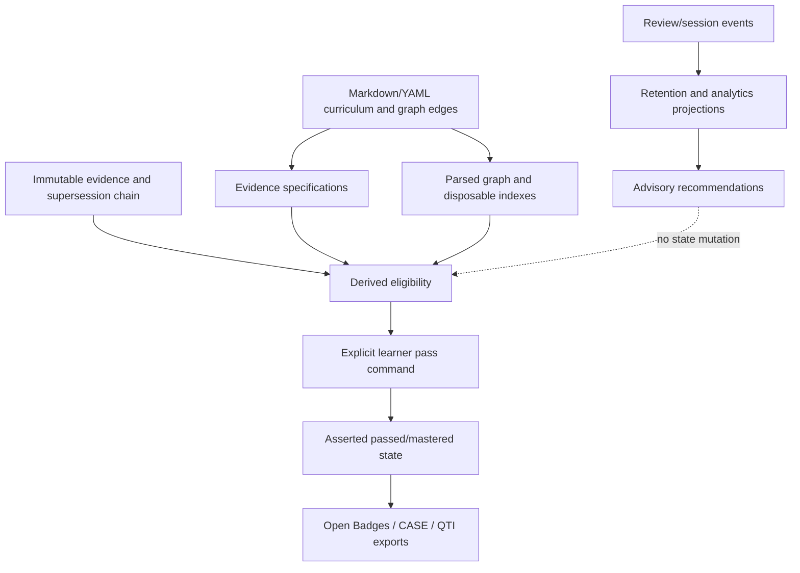

# What SkillTrace Can Learn from Comparable Open-Source Learning Systems

## Executive Summary

SkillTrace occupies a useful middle ground between flashcard schedulers, knowledge graphs, learning-management systems, competency catalogs, and credential formats. The strongest cross-project pattern is a separation of authored curriculum, learner evidence, derived projections, and explicit authority decisions. Anki/FSRS show how to keep review history separate from replaceable, reproducible retention projections; Kolibri and Moodle show how to separate sessions, attempts, completion, passing, and mastery; Org-roam demonstrates a rebuildable index over human-readable source files; and OpenSALT, OSMT, Open Badges, and QTI provide interoperability boundaries rather than replacement state machines.

SkillTrace should synthesize typed evidence/projection boundaries, versioned and reproducible retention overlays, explicit rule explanations, stable external provenance, and optional Open Badges/CASE/QTI adapters. It should not synthesize automatic pass/master transitions, AI acceptance, mutable evidence verdicts, database authority, event replay as state reconstruction, or imported relations that silently become hard prerequisites.

The recommended near-term direction is therefore additive: keep Markdown/YAML as the only authority, enrich evidence and derived analytics with provenance and policy snapshots, improve typed eligibility explanations and rebuildable indexes, then add interoperability as disposable projections. This aligns with SkillTrace’s current v1.6 event-log analytics direction and its existing five-layer architecture.[^1]

## Scope and Query Classification

This is a conceptual/explanatory comparison with a technical design component. The research covered nine focused investigations across Anki/FSRS, Kolibri, Moodle, Open edX, Logseq, Org-roam, Open Badges, OSMT, and OpenSALT, plus a direct baseline of SkillTrace’s current architecture and roadmap. Product features without an authoritative open-source implementation, including Mochi and RemNote, were excluded rather than inferred.

## SkillTrace Baseline

SkillTrace’s central architectural choice is that `graph/edges.yaml` is the sole relationship authority, while learner state lives in `graph/state.yaml`. Readiness (`locked`/`available`) is derived; asserted progress (`active`/`passed`/`mastered`) is separate and forward-only. Evidence records are immutable and corrected through superseding records. AI is advisory, not an acceptance authority; `pass_node`, `master_node`, and `delete_record` are hard-forbidden to automation.[^2]

The event log is audit-only, and Markdown/YAML files are the only source of truth. SQLite, exports, backups, and generated views are disposable and are not read back by the engine. Mutating commands append audit events, but event replay is not the state-reconciliation mechanism.[^3]

This means comparable systems should be treated as sources of patterns, not as authorities to import wholesale. The current roadmap’s next step is event-log analytics v1, followed by resource verification, classical-ML/adaptive-sequencing work, and only later broader adaptive overlays; the roadmap explicitly excludes auto-pass, auto-master, mutable mastery, and AI authority.[^4]

## Comparative Findings

### 1. Anki and FSRS: make retention a replaceable projection

Anki separates structured review evidence from scheduling state. Its revlog records the card, timestamp, rating, intervals, ease/memory-related values, duration, and review kind, while the card stores scheduling state such as queue, due value, interval, repetitions, and optional FSRS memory state.[^5] FSRS-rs similarly separates review histories (`FSRSItem`/`FSRSReview`) from `MemoryState`, next-state calculation, and optimizer parameters.[^6]

The most valuable synthesis is a retention overlay attached to existing SkillTrace evidence, not a second progress store:

```yaml
retention_projection:
  implementation: fsrs-rs
  implementation_version: <package-or-commit>
  input_snapshot: sha256:<review-event-snapshot>
  parameter_set: sha256:<parameters>
  memory_state:
    stability: 7.0
    difficulty: 5.0
  desired_retention: 0.9
  due: 2026-09-12T07:00:00Z
```

Every scheduler or optimizer result should retain its implementation/version, parameter identity, input snapshot, and training configuration. FSRS-rs exposes an explicit training seed and configuration, while Anki has scheduler upgrade behavior that records version changes and requires synchronization after upgrades.[^7]

The boundary is equally important: FSRS estimates recall behavior, not demonstrated competency. Its review schema has card ID, time, rating, state, and duration, but no artifact, rubric, prerequisite edge, or transfer assessment. SkillTrace should use retention analytics to recommend review timing and workload, never to create accepted evidence or flip `passed`/`mastered`.[^8]

**Synthesis priority:** high, but advisory-only. This is already compatible with SkillTrace’s shipped FSRS retention analytics and future adaptive-sequencing plans.[^9]

### 2. Kolibri: preserve raw interactions and projections separately

Kolibri’s logger is a layered model: a `ContentSessionLog` records a visit, `ContentSummaryLog` aggregates a learner’s history for content, `MasteryLog` represents an assessment try, and `AttemptLog` preserves item-level answers and interaction history. Attempt records retain correctness, hints, structured answers, errors, timestamps, duration, and ordered interaction history.[^10]

Kolibri also freezes the mastery criterion used for an attempt and deliberately uses stable identities to allow cross-device convergence. Its documentation says summaries should be recomputed from interaction logs after synchronization conflicts; its tests cover duplicate-attempt consolidation and Morango synchronization behavior.[^11]

SkillTrace should adopt the conceptual layering without copying Kolibri’s mutable database rows:

```text
immutable evidence / attempts
        ↓
derived eligibility and analytics projections
        ↓
explicit learner pass/master command
```

Useful additions include a snapshot of the criterion or policy version used for a projection, deterministic identifiers for evidence and attempts, and documented duplicate/convergence rules for any future multi-device feature. However, SkillTrace’s source-of-truth rule requires retaining pre-consolidation records; deleting duplicate rows after merging, as Kolibri does for a database projection, would conflict with immutable evidence.[^12]

**Synthesis priority:** high for evidence/projection vocabulary and future synchronization design; do not adopt its mutable-row authority.

### 3. Moodle: distinguish complete, passed, failed, and eligible

Moodle’s completion state machine distinguishes incomplete, generic complete, complete-pass, complete-fail, hidden-fail, and grade-change states. Generic completion is deliberately not equivalent to passing. Activity plugins contribute typed completion rules, and the aggregate is deterministic: incomplete dominates, then failure, then pass, then generic completion.[^13]

Moodle also demonstrates why attempt evidence must not be confused with acceptance. Quiz completion can depend on a passing grade, a minimum attempt count, or exhaustion of attempts; attempt exhaustion can complete an activity without proving a pass.[^14]

SkillTrace should make eligibility explanations similarly typed and inspectable. A derived result should be able to say, for example:

```text
eligible: false
reasons:
  - evidence_gate: satisfied
  - hard_prerequisites: satisfied
  - asserted_pass: missing
  - post_pass_review: not_due
```

This preserves the distinction between evidence, derived eligibility, and the explicit learner action. Moodle’s manual completion and override mechanism is a useful reminder to retain actor attribution, but its current completion rows are mutable; SkillTrace should record commands/events append-only and keep current status derived or guarded.[^15]

**Synthesis priority:** high. Adopt typed rule outcomes and explainability, not Moodle’s mutable completion authority or instructor override model.

### 4. Open edX: separate authored structure, learner state, and projections

Open edX separates published course metadata and block structure from per-learner `StudentModule` state and persistent subsection/course grade projections. Its progress APIs derive learner-visible structure, fractional completion, boolean completion, resume state, grade, and pass status as distinct concepts.[^16]

The strongest transferable idea is the projection vocabulary:

```text
fractional progress ≠ boolean completion ≠ grade ≠ pass ≠ resume position
```

Open edX also emits named events for submissions, scoring, completion, first pass, current pass, and current failure, with transaction and policy/version context. Its proposed offline design queues local submissions and replays them through normal handlers, while versioning downloaded content and making unsupported offline interactions explicit.[^17]

For SkillTrace, this supports future export/import adapters and local action queues, but not a server-style asynchronous grading pipeline. A local-first implementation can retain append-only evidence and deterministic projections without adopting XBlock archives, mobile bridges, or server fan-out.

**Synthesis priority:** medium. Adopt the projection vocabulary, content/version provenance, and explicit offline capability boundaries.

### 5. Org-roam and Logseq: source-first graphs and disposable indexes

Org-roam is the closest architectural precedent for SkillTrace’s Markdown/YAML authority model. Plain Org files remain usable without Org-roam; an SQLite database indexes nodes, links, tags, references, and file hashes. Synchronization reparses only changed files and treats the database as rebuildable cache.[^18]

Logseq provides useful identity, query, and incremental-index patterns: stable UUIDs, typed block references, DataScript/Datalog queries, transaction-driven search updates, and post-commit derived handlers. But its DB Graph model makes the database authoritative and its Markdown Mirror explicitly non-bidirectional and not guaranteed as a backup/import format.[^19]

SkillTrace should synthesize:

1. Stable IDs for nodes, evidence, attempts, and external references.
2. Explicit typed edges rather than title/path identity or fuzzy backlinks.
3. Source-file hashes and a full rebuild path for disposable indexes.
4. Source commit first, index/search/export update second.
5. Schema-aware migrations with a source backup before rewriting identifiers.

SkillTrace should avoid Logseq’s hidden second authority. Any SQLite index, HTML export, web cache, or search database must remain disposable and never become readable state.[^20]

**Synthesis priority:** high for indexing and identity; reject database authority.

### 6. OSMT and OpenSALT: import curriculum metadata without importing learner state

WGU’s Open Skills Management Tool models reusable skill descriptors, UUIDs, statements, publication metadata, standards, certifications, alignments, occupations, employers, and collections. OpenSALT models CASE-style framework documents, competency items, typed associations, external references, rubrics, criteria, and criterion levels.[^21]

These are valuable upstream curriculum/catalogue systems, not learner-state engines. SkillTrace could preserve imported provenance:

```yaml
external:
  source: osmt | opensalt
  source_uri: <stable-uri>
  source_uuid: <external-id>
  source_commit: <commit-or-content-hash>
  imported_at: <timestamp>
  mapping_policy: metadata_only
```

OpenSALT’s typed relations suggest a richer vocabulary around SkillTrace edges: taxonomy, equivalence/alignment, replacement/version lineage, exemplar, and advisory sequence. Only an explicit mapping to `hard_prerequisite` should affect locking; `isChildOf`, `isPartOf`, `related`, `exactMatch`, and `precedes` must not silently become prerequisites.[^22]

Rubrics can seed artifact specifications, evidence expectations, and learner-facing checklists. Imported rubric scores must remain observed results; they cannot directly create SkillTrace eligibility or asserted progress.[^23]

**Synthesis priority:** medium-high for provenance-preserving imports and future graph vocabulary; no external catalog may write `graph/state.yaml`.

### 7. Open Badges, CASE, and QTI: interoperability as derived projections

Open Badges 3.0 separates achievement definitions, evidence, results, alignments, and credential verification. Its verification specification explicitly says that verifying schema/proof/status does not establish the truth of the underlying achievement claim.[^24] This maps directly to SkillTrace’s distinction between external verification, substantive evidence acceptance, and explicit learner authority.

SkillTrace should eventually support a derived Open Badges export with fields that remain separate:

```yaml
external_verification:
  schema_valid: true
  proof_valid: true
  issuer_status: valid
  recipient_binding: verified

skilltrace_acceptance:
  status: accepted
  evidence_refs: [evidence-...]
  authority: learner_manual
```

An imported badge should preserve its original payload, retrieval time, source hash, issuer, and status checks. External revocation should become status/provenance metadata or a new local correction record, never deletion or in-place mutation of historical SkillTrace evidence.[^25]

CASE/OpenSALT can provide competency and rubric identifiers; QTI can provide portable assessment items, response processing, outcomes, and score metadata. Neither should be treated as SkillTrace’s acceptance authority. A valid badge, CASE rubric level, or QTI score may become candidate/objective evidence, but the existing evidence gate and explicit `pass`/`master` command remain authoritative.[^26]

**Synthesis priority:** medium, after the internal evidence/projection contracts are stable.

## Recommended Synthesis for SkillTrace

### Adopt now or in the next roadmap slots

| Idea | Proposed SkillTrace placement | Guardrail |
|---|---|---|
| Typed eligibility outcomes and explanations | Evidence/eligibility read models | No state mutation |
| Criterion/policy snapshots | Evidence records and derived projection metadata | Snapshot is provenance, not authority |
| Reproducible retention projections | Policy/analytics overlay | Advisory only |
| Stable IDs and typed external provenance | Graph/evidence metadata | External IDs never replace local IDs |
| Rebuildable source indexes | Disposable export/search infrastructure | Never read back as truth |
| Separate progress, completion, pass, mastery, and resume concepts | CLI/UI read models | Preserve existing state machine |
| Explicit duplicate/merge rules | Future sync/import design | Never delete immutable source evidence |
| Open Badges/CASE/QTI adapters | Release/export layer | Derived projections only |

### Do not synthesize

1. Automatic pass or mastery from a scheduler, badge, rubric, model, or imported grade.
2. AI or validator output as an acceptance authority.
3. Mutable evidence verdicts; corrections must supersede.
4. A database, card collection, cloud service, or generated Markdown mirror as a second source of truth.
5. Event replay as learner-state reconstruction.
6. Imported curriculum sequencing as hard prerequisites without an explicit local policy mapping.
7. Demotion of asserted `passed` or `mastered` after a later review failure.
8. Percent completion as a substitute for accepted evidence or demonstrated skill.

## Target Architecture



The key design rule is that every arrow toward learner state passes through an existing guarded command. Analytics and interoperability can enrich explanations and exports, but they cannot become hidden writers.

## Phased Implementation Recommendations

### v1.6: event-log analytics v1

Use the current event log as an analytics input to produce study velocity, blockers by domain, review completion, and evidence coverage. Add stable event names, policy/version metadata, and explainable read models if needed, but do not replay events into state.[^27]

### v1.7: resource verification and provenance

Represent resource verification, retrieval time, source hash, and stale-resource status as immutable provenance or advisory metadata. A validator result should remain distinct from substantive evidence acceptance.

### v1.8-v1.9: curriculum imports and generated proposals

Add OSMT/OpenSALT/CASE import adapters that preserve source UUIDs, URIs, commits, relation types, and mapping policy. Imported or generated nodes should be proposals until locally validated; no importer writes learner progress or silently changes hard prerequisites.

### v2.x: adaptive sequencing and credential export

Use FSRS and event analytics to rank recommendations and review timing. Add Open Badges/QTI exports only as derived release artifacts. Require explicit evidence references and learner authority in any credential export, and preserve external verification separately from local acceptance.

## Confidence Assessment

**High confidence:** the source/projection/authority separation is consistently supported by Anki/FSRS, Kolibri, Moodle, Org-roam, Open edX, and SkillTrace’s own architecture. The boundaries around explicit pass/master commands, AI advisory status, immutable evidence, and Markdown/YAML authority are directly documented in SkillTrace sources.[^28]

**Moderate confidence:** the proposed CASE/OpenSALT/OSMT import shape and Open Badges export boundary are strong interoperability recommendations, but the exact adapter schema should be finalized only when a concrete release requirement exists. Open Badges validator compatibility is version-sensitive: the inspected validator is principally a 2.0 implementation even though the specification repository contains 3.0 material.[^29]

**Moderate confidence:** future synchronization should borrow Kolibri’s deterministic identity and explicit consolidation principles, but SkillTrace does not yet have a defined multi-device merge model. No synchronization feature should be added until conflicts among append-only evidence, supersession chains, audit events, and forward-only progress are specified.

**Assumptions:** SkillTrace remains curriculum-agnostic; external systems supply seed metadata or disposable interoperability projections rather than engine semantics. “Mastery” continues to mean SkillTrace’s explicit asserted state, not a scheduler’s memory estimate or a credential’s verification result.

## Footnotes

[^1]: [docs/POST_V1_ROADMAP.md:20-61](https://github.com/earledotpy/skilltrace/blob/23a995ec80c48484cd8215b7ccf95d3610f538a0/docs/POST_V1_ROADMAP.md#L20-L61)
[^2]: [src/skilltrace/graph/state.py:42-46,110-152](https://github.com/earledotpy/skilltrace/blob/a1e4be26aa4446c52bd3c5ad84c6e15114335cfd/src/skilltrace/graph/state.py#L42-L46); [src/skilltrace/evidence/records.py:67-74,118-143](https://github.com/earledotpy/skilltrace/blob/f53dd758fa3ba7e379a17fd2159c8ca6efe4dac7/src/skilltrace/evidence/records.py#L67-L74); [src/skilltrace/automation.py:22-26,80-113](https://github.com/earledotpy/skilltrace/blob/469c933ff5e8f1a0c6ab2b992e7e962595a9b60e/src/skilltrace/automation.py#L22-L26)
[^3]: [CONTEXT.md:332-345](https://github.com/earledotpy/skilltrace/blob/638620744068643953c380aa4897de6cdc2484aa/CONTEXT.md#L332-L345); [src/skilltrace/dispatch.py:127-154](https://github.com/earledotpy/skilltrace/blob/6b44f51e2f1c1e8a767b702c0a5710cf2c7103af/src/skilltrace/dispatch.py#L127-L154)
[^4]: [docs/POST_V1_ROADMAP.md:38-61,80-105](https://github.com/earledotpy/skilltrace/blob/23a995ec80c48484cd8215b7ccf95d3610f538a0/docs/POST_V1_ROADMAP.md#L38-L61)
[^5]: [ankitects/anki:rslib/src/revlog/mod.rs:21-137](https://github.com/ankitects/anki/blob/5edc31694f07487266bb8c4725508f6c5f5c198d/rslib/src/revlog/mod.rs#L21-L137); [ankitects/anki:proto/anki/cards.proto:28-67](https://github.com/ankitects/anki/blob/5edc31694f07487266bb8c4725508f6c5f5c198d/proto/anki/cards.proto#L28-L67)
[^6]: [open-spaced-repetition/fsrs-rs:README.md:25-56](https://github.com/open-spaced-repetition/fsrs-rs/blob/99386f0c919cbc240722a35a5fdb539835c2d647/README.md#L25-L56); [open-spaced-repetition/fsrs-rs:examples/schedule.rs:65-119](https://github.com/open-spaced-repetition/fsrs-rs/blob/99386f0c919cbc240722a35a5fdb539835c2d647/examples/schedule.rs#L65-L119)
[^7]: [open-spaced-repetition/fsrs-rs:src/training.rs:176-190,281-353](https://github.com/open-spaced-repetition/fsrs-rs/blob/99386f0c919cbc240722a35a5fdb539835c2d647/src/training.rs#L176-L190); [ankitects/anki:rslib/src/scheduler/upgrade.rs:68-84](https://github.com/ankitects/anki/blob/5edc31694f07487266bb8c4725508f6c5f5c198d/rslib/src/scheduler/upgrade.rs#L68-L84)
[^8]: [open-spaced-repetition/fsrs-optimizer:README.md:11-34](https://github.com/open-spaced-repetition/fsrs-optimizer/blob/ac2a82d222c4ea809985236e2a52e058da524c40/README.md#L11-L34)
[^9]: [docs/POST_V1_ROADMAP.md:20-61](https://github.com/earledotpy/skilltrace/blob/23a995ec80c48484cd8215b7ccf95d3610f538a0/docs/POST_V1_ROADMAP.md#L20-L61)
[^10]: [learningequality/kolibri:kolibri/core/logger/models.py:107-168,232-334](https://github.com/learningequality/kolibri/blob/356cfe2f51de14e90dca38d312d6abcb43311893/kolibri/core/logger/models.py#L107-L168); [learningequality/kolibri:kolibri/core/logger/models.py:232-334](https://github.com/learningequality/kolibri/blob/356cfe2f51de14e90dca38d312d6abcb43311893/kolibri/core/logger/models.py#L232-L334)
[^11]: [learningequality/kolibri:kolibri/core/logger/models.py:245-275](https://github.com/learningequality/kolibri/blob/356cfe2f51de14e90dca38d312d6abcb43311893/kolibri/core/logger/models.py#L245-L275); [learningequality/kolibri:docs/backend_architecture/logger/concepts_and_definitions.rst:36-48](https://github.com/learningequality/kolibri/blob/356cfe2f51de14e90dca38d312d6abcb43311893/docs/backend_architecture/logger/concepts_and_definitions.rst#L36-L48)
[^12]: [learningequality/kolibri:kolibri/core/logger/utils/attempt_log_consolidation.py:13-43](https://github.com/learningequality/kolibri/blob/356cfe2f51de14e90dca38d312d6abcb43311893/kolibri/core/logger/utils/attempt_log_consolidation.py#L13-L43)
[^13]: [moodle/moodle:public/lib/completionlib.php:68-106,706-740](https://github.com/moodle/moodle/blob/8eae8fc94d0e3932cbc64f1e81414903a1e2e83/public/lib/completionlib.php#L68-L106); [moodle/moodle:public/completion/classes/cm_completion_details.php:192-222](https://github.com/moodle/moodle/blob/8eae8fc94d0e3932cbc64f1e81414903a1e2e83/public/completion/classes/cm_completion_details.php#L192-L222)
[^14]: [moodle/moodle:public/mod/quiz/classes/completion/custom_completion.php:45-63,155-161](https://github.com/moodle/moodle/blob/8eae8fc94d0e3932cbc64f1e81414903a1e2e83/public/mod/quiz/classes/completion/custom_completion.php#L45-L63)
[^15]: [moodle/moodle:public/lib/completionlib.php:632-660](https://github.com/moodle/moodle/blob/8eae8fc94d0e3932cbc64f1e81414903a1e2e83/public/lib/completionlib.php#L632-L660)
[^16]: [openedx/edx-platform:lms/djangoapps/courseware/models.py:78-121,169-178](https://github.com/openedx/edx-platform/blob/f3a87b132a301789659fc9ae565c95fb85dee48d/lms/djangoapps/courseware/models.py#L78-L121); [openedx/edx-platform:lms/djangoapps/course_api/blocks/transformers/block_completion.py:86-141](https://github.com/openedx/edx-platform/blob/f3a87b132a301789659fc9ae565c95fb85dee48d/lms/djangoapps/course_api/blocks/transformers/block_completion.py#L86-L141)
[^17]: [openedx/edx-platform:lms/djangoapps/grades/events.py:34-43,46-105](https://github.com/openedx/edx-platform/blob/f3a87b132a301789659fc9ae565c95fb85dee48d/lms/djangoapps/grades/events.py#L34-L105); [openedx/edx-platform:openedx/features/offline_content/docs/001-mobile-offline-content-support.rst:8-21,84-104](https://github.com/openedx/edx-platform/blob/f3a87b132a301789659fc9ae565c95fb85dee48d/openedx/features/offline_content/docs/001-mobile-offline-content-support.rst#L8-L21)
[^18]: [org-roam/org-roam:README.md:5-20](https://github.com/org-roam/org-roam/blob/6692e99bbd4111f478ada96c2ca90d8efdeb8d40/README.md#L5-L20); [org-roam/org-roam:org-roam-db.el:551-630](https://github.com/org-roam/org-roam/blob/20934cfb5a2e7ae037ec10bbc81ca97478738178/org-roam-db.el#L551-L630)
[^19]: [logseq/logseq:docs/adr/0016-markdown-mirror.md:31-38,235-263](https://github.com/logseq/logseq/blob/427dbe3f58984f9a431c1e9e807383e3ba88657f/docs/adr/0016-markdown-mirror.md#L31-L38); [logseq/logseq:libs/src/LSPlugin.ts:184-201,953-982](https://github.com/logseq/logseq/blob/a40fd3f7b8b036858e2dd262722385bc426173b2/libs/src/LSPlugin.ts#L184-L201)
[^20]: [CONTEXT.md:332-337](https://github.com/earledotpy/skilltrace/blob/638620744068643953c380aa4897de6cdc2484aa/CONTEXT.md#L332-L337)
[^21]: [wgu-opensource/osmt:api/src/main/kotlin/edu/wgu/osmt/richskill/RichSkillDescriptor.kt:30-67](https://github.com/wgu-opensource/osmt/blob/7fd31dbf922b445bd82815bfd41a60aa39dd15d3/api/src/main/kotlin/edu/wgu/osmt/richskill/RichSkillDescriptor.kt#L30-L67); [opensalt/opensalt:core/src/Entity/Framework/LsItem.php:21-169](https://github.com/opensalt/opensalt/blob/0ad5d2a0cffb1074a434f90eefbed11232278a8f/core/src/Entity/Framework/LsItem.php#L21-L169)
[^22]: [opensalt/opensalt:core/src/Entity/Framework/LsAssociation.php:43-103,302-342](https://github.com/opensalt/opensalt/blob/0ad5d2a0cffb1074a434f90eefbed11232278a8f/core/src/Entity/Framework/LsAssociation.php#L43-L103)
[^23]: [opensalt/opensalt:core/src/Entity/Framework/CfRubricCriterion.php:23-57](https://github.com/opensalt/opensalt/blob/0ad5d2a0cffb1074a434f90eefbed11232278a8f/core/src/Entity/Framework/CfRubricCriterion.php#L23-L57); [opensalt/opensalt:core/src/Entity/Framework/CfRubricCriterionLevel.php:21-46](https://github.com/opensalt/opensalt/blob/0ad5d2a0cffb1074a434f90eefbed11232278a8f/core/src/Entity/Framework/CfRubricCriterionLevel.php#L21-L46)
[^24]: [1EdTech/openbadges-specification:ob_v3p0/verification.md:3-10,15-65](https://github.com/1EdTech/openbadges-specification/blob/3af5074653a49785d9c81e367bcd2886d5ba70aa/ob_v3p0/verification.md#L3-L10)
[^25]: [1EdTech/openbadges-specification:ob_v2p0/index.md:230-248,670-730](https://github.com/1EdTech/openbadges-specification/blob/3af5074653a49785d9c81e367bcd2886d5ba70aa/ob_v2p0/index.md#L230-L248)
[^26]: [IMSGlobal/openbadges-validator-core:README.md:52-66,162-168](https://github.com/IMSGlobal/openbadges-validator-core/blob/0a66b52a8a0b7841469a35b056e5c3f8e5ce87d1/README.md#L52-L66); [CASE 1.1 specification](https://www.imsglobal.org/spec/case/v1p1); [QTI 3.0 implementation guide, section 3.7.1](https://www.imsglobal.org/spec/qti/v3p0/impl#h.fi29q8dubjgw)
[^27]: [docs/POST_V1_ROADMAP.md:38-45](https://github.com/earledotpy/skilltrace/blob/23a995ec80c48484cd8215b7ccf95d3610f538a0/docs/POST_V1_ROADMAP.md#L38-L45)
[^28]: [CONTEXT.md:90-94,141-147,159-186](https://github.com/earledotpy/skilltrace/blob/638620744068643953c380aa4897de6cdc2484aa/CONTEXT.md#L90-L94); [docs/adr/0003-acceptance-frozen-at-submission.md:26-56](https://github.com/earledotpy/skilltrace/blob/f53dd758fa3ba7e379a17fd2159c8ca6efe4dac7/docs/adr/0003-acceptance-frozen-at-submission.md#L26-L56)
[^29]: [IMSGlobal/openbadges-validator-core:README.md:62-66](https://github.com/IMSGlobal/openbadges-validator-core/blob/0a66b52a8a0b7841469a35b056e5c3f8e5ce87d1/README.md#L62-L66)
