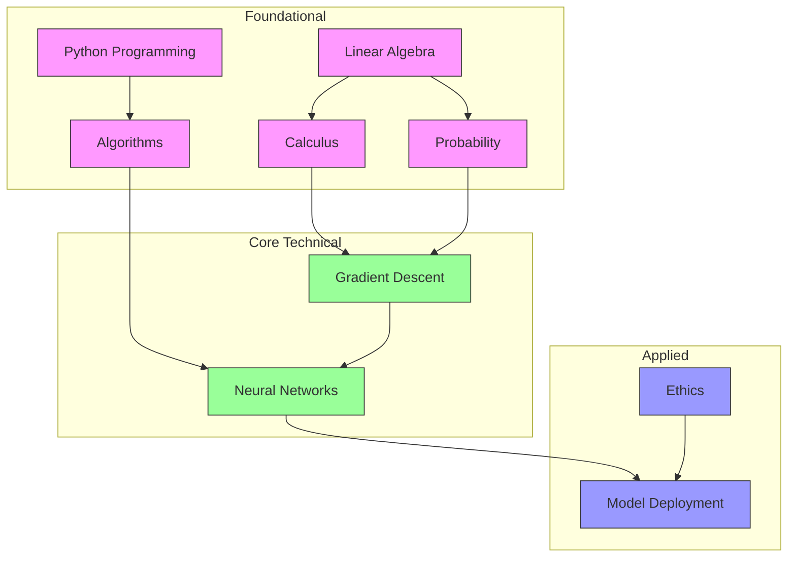

# Competency-Based Artificial Intelligence Learning Framework
## A Modular, Self-Directed Mastery System for Career Changers

**Author:** Educational Systems Architect Consultant  
**Date:** June 28, 2026  
**Target Learner:** Jeremy Earle (Mid-life career changer)  
**Domain:** Artificial Intelligence  
**Objective:** Deep proficiency to understand, analyze, and contribute to current AI systems  

---

## Executive Summary

This document presents a comprehensive **5-Pillar Competency-Based Learning Framework** designed to transform a mid-life career changer with 8-10 hours/week of study time into a deeply proficient AI practitioner. The framework abandons traditional time-bound syllabi in favor of a dynamic **Skill Graph** architecture that prioritizes mastery, automated analytics, and the integration of core technical skills with adjacent contextual domains.

**Key Design Principles:**
- **Modularity:** Skills are discrete, testable units with explicit dependencies
- **Mastery-First:** Progression based on demonstrated competence, not time spent
- **Contextual Integration:** Parallel progression across technical and adjacent domains
- **Evidence-Based:** Grounded in Mastery Learning, Constructivism, and Cumulative Learning Theory
- **Open-Source First:** Prioritizes free, self-hostable, privacy-preserving tools

---

## Phase 1: Discovery Interview Summary

### 1. Scope & Adjacent Domains
**Decision:** All seven adjacent domains are **co-equal pillars** with core AI technical skills.

**Included Domains:**
1. Mathematics (Linear Algebra, Calculus, Probability/Statistics)
2. Computer Science Fundamentals (Algorithms, Data Structures, Complexity Theory)
3. Ethics & Governance (Bias, Fairness, Privacy, Regulation)
4. Data Engineering (Data Pipelines, ETL, Databases)
5. MLOps/Cloud Deployment (Model Serving, CI/CD, Scalability)
6. Cognitive Science/Philosophy of Mind
7. Communication (Technical Writing, Presentation)

**Architectural Structure:** **Parallel Tracks with Contextual Integration** - Domains progress simultaneously with explicit connections drawn between them (e.g., studying calculus while applying it to gradient descent).

### 2. Competency Definitions
**Definition of Mastery:** **Hybrid Model** combining:
- **70% Formative Assessments** (low-stakes quizzes, self-checks, automated exercises)
- **20% Summative Assessments** (high-stakes projects, comprehensive exams)
- **10% Peer/Community Validation** (code reviews, presentations, teaching others)

**Mastery Thresholds (Tiered):**
- **Foundational Domains** (Mathematics, CS Fundamentals): 90%
- **Core Technical Domains** (ML Algorithms, Neural Networks): 85%
- **Applied/Contextual Domains** (Ethics, MLOps, Communication): 80%

### 3. Analytics & Feedback Preferences
**Feedback Balance:** **Balanced Hybrid** - 70% automated diagnostics, 30% self-assessment

**Diagnostic Modeling Techniques:**
- **Bayesian Knowledge Tracing (BKT)** - Probabilistic mastery estimation
- **Elo-rating System** - Relative difficulty scaling for adaptive problem sets
- **Spaced Repetition (SM-2 Algorithm)** - Long-term retention scheduling

### 4. Environmental Constraints
- **Hardware:** Windows 11 laptop with WSL2 + Cloud services
- **Budget:** $50/month for cloud resources
- **Connectivity:** Stable high-speed internet
- **Software Environment:** Hybrid (local for lightweight tasks, cloud for resource-intensive work)

---

# Phase 2: The 5-Pillar Framework

## Pillar 1: Architectural Paradigm (The Skill Graph)

### 1.1 Core Philosophy: From Linear to Graph-Based Learning

Traditional educational models follow a **linear timeline** where all learners progress through the same sequence at the same pace. This framework adopts a **dependency-aware Skill Graph** model, where:

- **Nodes** represent discrete, testable skills or competencies
- **Directed edges** represent prerequisite relationships
- **Weighted edges** indicate the strength of dependency (hard prerequisite vs. recommended prior knowledge)
- **Parallel paths** enable simultaneous progression across related domains

**Theoretical Foundation:**
- **Mastery Learning (Bloom, 1968):** Students must achieve a level of mastery in prerequisite skills before advancing
- **Constructivism (Piaget, Vygotsky):** Learning is contextual and builds upon prior knowledge
- **Cumulative Learning Theory:** Errors in foundational knowledge compound in dependent domains

### 1.2 Graph Structure Design

#### 1.2.1 Node Classification

Each node in the Skill Graph is classified by:

| Attribute | Description | Example |
|-----------|-------------|---------|
| **Domain** | Primary knowledge area | Mathematics, Core AI, Ethics |
| **Tier** | Progression level | Foundational, Intermediate, Advanced |
| **Type** | Nature of the skill | Conceptual, Applied, Theoretical |
| **Complexity** | Cognitive load | Low, Medium, High |
| **Estimated Hours** | Time to mastery | 2-20 hours |

#### 1.2.2 Edge Classification

| Edge Type | Description | Weight | Example |
|-----------|-------------|--------|---------|
| **Hard Prerequisite** | Must be mastered before attempting | 1.0 | Linear Algebra → Neural Networks |
| **Soft Prerequisite** | Recommended prior knowledge | 0.7 | Probability → Bayesian Methods |
| **Co-requisite** | Should be studied in parallel | 0.5 | Calculus + Neural Networks |
| **Contextual Link** | Provides useful context | 0.3 | Ethics → Model Deployment |

#### 1.2.3 Graph Visualization Schema



*Color Coding: Foundational (Pink), Core Technical (Green), Applied/Contextual (Blue)*

### 1.3 Adaptive Sequencing Engine

#### 1.3.1 Core Algorithm

The adaptive sequencing engine uses a **modified Topological Sort** with the following priorities:

1. **Prerequisite Satisfaction:** Only nodes with all hard prerequisites mastered are eligible
2. **Learning Momentum:** Prioritize nodes in domains where recent progress has been made
3. **Balanced Progression:** Ensure parallel advancement across at least 2-3 domains
4. **Personal Interest:** Allow learner to express preference for certain domains
5. **Time Optimization:** Estimate time-to-completion for eligible nodes

**Algorithm Pseudocode:**
```python
ndef get_next_skills(learner_state, skill_graph, preferences):
    # Filter eligible nodes (all hard prerequisites mastered)
    eligible = [n for n in skill_graph.nodes 
                if all(p in learner_state.mastered 
                       for p in n.hard_prerequisites)]
    
    # Score each eligible node
    for node in eligible:
        node.score = (
            0.4 * learning_momentum(node.domain, learner_state) +
            0.3 * balanced_progression_score(learner_state) +
            0.2 * preference_match(node, preferences) +
            0.1 * time_optimization(node, learner_state.time_budget)
        )
    
    # Return top N recommendations
    return sorted(eligible, key=lambda x: x.score, reverse=True)[:5]
```

#### 1.3.2 Remediation Paths

When a learner struggles with a skill (fails to achieve mastery threshold after N attempts), the system:

1. **Diagnoses Root Cause:**
   - Analyzes performance patterns using BKT
   - Identifies specific sub-skills with gaps
   - Checks for prerequisite weaknesses

2. **Generates Remediation Path:**
   - Creates targeted review modules for weak sub-skills
   - Suggests alternative learning resources
   - Adjusts difficulty of practice problems (Elo-based)

3. **Implements Spaced Repetition:**
   - Schedules review sessions using SM-2 algorithm
   - Increases review frequency for struggling concepts
   - Decreases frequency for mastered concepts

**Remediation Example:**
If a learner struggles with **Backpropagation**, the system might:
- Diagnose: Weakness in **Chain Rule** (from Calculus) and **Matrix Multiplication** (from Linear Algebra)
- Generate: Remediation path through targeted calculus and linear algebra modules
- Schedule: Daily reviews of chain rule, every-other-day reviews of matrix operations

### 1.4 Graph Evolution

The Skill Graph is **not static**. It evolves through:

1. **Learner Feedback:** Nodes can be marked as too easy, too hard, or miscategorized
2. **Performance Analytics:** If many learners struggle with a node, its prerequisites may need adjustment
3. **Domain Updates:** As AI field evolves, new nodes are added (e.g., Diffusion Models, LLMs)
4. **Personalization:** Learner can add custom nodes for specific interests

---

## Pillar 2: Domain Curation & Curriculum Mapping

### 2.1 Curriculum Tier Architecture

The curriculum is organized into **four tiers**, each containing nodes from multiple domains:

#### Tier 1: Foundational (Mathematical & Computational)
*Prerequisite for all other tiers. Mastery threshold: 90%*

| Domain | Skills | Estimated Hours | Key Resources |
|--------|--------|-----------------|----------------|
| Mathematics | Linear Algebra (Vectors, Matrices, Operations) | 15 | 3Blue1Brown Essence of Linear Algebra (Free), Khan Academy |
| Mathematics | Calculus (Derivatives, Integrals, Partial Derivatives) | 20 | 3Blue1Brown Essence of Calculus, MIT OCW Single Variable Calculus |
| Mathematics | Probability & Statistics (Distributions, Bayes' Theorem, Hypothesis Testing) | 25 | Harvard Stat 110 (Free), Khan Academy Probability |
| CS Fundamentals | Python Programming (Syntax, Data Structures, OOP) | 30 | Python.org Tutorial, Automate the Boring Stuff (Free) |
| CS Fundamentals | Algorithms & Complexity (Big-O, Sorting, Searching) | 20 | Grokking Algorithms (Free), MIT 6.006 |
| CS Fundamentals | Computer Architecture Basics | 10 | Nand2Tetris (Free), Code.org CS Principles |

#### Tier 2: Core Technical (AI/ML Fundamentals)
*Prerequisite: Tier 1 completion. Mastery threshold: 85%*

| Domain | Skills | Estimated Hours | Key Resources |
|--------|--------|-----------------|----------------|
| Core AI | Machine Learning Basics (Supervised vs Unsupervised) | 10 | Google ML Crash Course (Free), Fast.ai Practical Deep Learning |
| Core AI | Linear Regression & Logistic Regression | 15 | Stanford CS 229 Notes (Free), scikit-learn Tutorials |
| Core AI | Neural Networks Fundamentals | 20 | Neural Networks and Deep Learning (deeplearning.ai, Free) |
| Core AI | Training Neural Networks (Backpropagation, Gradient Descent) | 25 | CS 231n Stanford (Free), PyTorch Tutorials |
| Core AI | Common Architectures (CNNs, RNNs, Transformers) | 30 | Dive into Deep Learning (Free), Hugging Face Course |
| Mathematics | Numerical Optimization | 15 | Convex Optimization (Boyd, Free PDF), Optimization for ML (Free) |

#### Tier 3: Systems & Deployment
*Prerequisite: Tier 2 completion. Mastery threshold: 85%*

| Domain | Skills | Estimated Hours | Key Resources |
|--------|--------|-----------------|----------------|
| MLOps | Model Deployment (Flask, FastAPI) | 15 | Full Stack Deep Learning (Free), FastAPI Docs |
| MLOps | Containerization (Docker, Kubernetes Basics) | 20 | Docker Curriculum (Free), K8s Tutorials |
| MLOps | CI/CD for ML (GitHub Actions, GitLab CI) | 15 | ML Engineering (Free), GitHub Docs |
| Data Engineering | Data Pipelines (Apache Airflow, Prefect) | 20 | Airflow Tutorials (Free), Data Engineering Zoomcamp |
| Data Engineering | Databases (SQL, NoSQL, BigQuery) | 25 | SQLZoo (Free), Mode Analytics SQL Tutorial |
| Cloud | Cloud Basics (AWS/GCP Free Tier) | 15 | AWS Free Tier, Google Cloud Free Program |
| Cloud | Serverless ML (Lambda, Cloud Functions) | 15 | AWS Lambda Docs, GCP Functions Docs |

#### Tier 4: Adjacent & Contextual Domains
*Can be started after Tier 1, but full integration requires Tier 2+. Mastery threshold: 80%*

| Domain | Skills | Estimated Hours | Key Resources |
|--------|--------|-----------------|----------------|
| Ethics | AI Ethics & Bias | 15 | AI Ethics (MIT, Free), Fairlearn Docs |
| Ethics | Privacy & Regulation (GDPR, AI Act) | 10 | GDPR Text (Free), AI Act Summary |
| Ethics | Responsible AI Development | 10 | Google Responsible AI (Free), Partnership on AI |
| Cognitive Science | Philosophy of Mind | 10 | Stanford Encyclopedia of Philosophy (Free) |
| Cognitive Science | Human Cognition Basics | 10 | Cognitive Psychology (OpenStax, Free) |
| Communication | Technical Writing for AI | 10 | Google Technical Writing Course (Free) |
| Communication | Presentation & Teaching | 10 | Toastmasters (Free Resources), Teaching in Public |

### 2.2 Curriculum Mapping: Parallel Tracks

The **Parallel Tracks with Contextual Integration** approach means:

1. **Simultaneous Progression:** Learner can work on nodes from multiple tiers/domains in parallel
2. **Explicit Connections:** The system highlights relationships between parallel nodes
3. **Contextual Application:** Theoretical concepts are immediately applied in practical contexts

**Example Parallel Track (Week 1-4):**

| Week | Track 1: Mathematics | Track 2: Core AI | Track 3: CS Fundamentals | Integration Point |
|------|---------------------|------------------|--------------------------|-------------------|
| 1 | Linear Algebra: Vectors | ML Basics: Supervised Learning | Python: Lists & Arrays | Use NumPy arrays for vector operations in ML |
| 2 | Linear Algebra: Matrix Operations | Linear Regression | Python: NumPy | Implement linear regression from scratch using matrices |
| 3 | Calculus: Derivatives | Gradient Descent | Python: Functions | Code gradient descent algorithm |
| 4 | Calculus: Partial Derivatives | Training Neural Networks | Python: Classes | Build simple neural network class with backpropagation |

**Example Parallel Track (Week 5-8):**

| Week | Track 1: Mathematics | Track 2: Core AI | Track 3: Ethics | Integration Point |
|------|---------------------|------------------|-----------------|-------------------|
| 5 | Probability: Bayes' Theorem | Bayesian Methods | AI Bias Basics | Discuss bias in Bayesian models |
| 6 | Statistics: Hypothesis Testing | Model Evaluation | Fairness Metrics | Implement fairness evaluation for models |
| 7 | Numerical Optimization | Advanced Training | Privacy Basics | Discuss privacy implications of optimization |
| 8 | - | Transformers | Responsible AI | Analyze transformer models through ethics lens |

### 2.3 Resource Curation Principles

All curated resources adhere to the following criteria:

1. **Open Access:** Free or low-cost (within $50/month budget)
2. **Self-Paced:** Asynchronous learning compatible with 8-10 hours/week
3. **Hands-On:** Includes practical exercises or projects
4. **Community Supported:** Active forums, discussion groups, or open-source communities
5. **High Quality:** From reputable institutions or well-reviewed by the community
6. **Progressive Difficulty:** Clear progression from beginner to advanced

**Resource Prioritization:**
- **Primary:** Free, interactive, with built-in assessments (e.g., Fast.ai, Google ML Crash Course)
- **Secondary:** Free, high-quality but less interactive (e.g., MIT OCW, Stanford CS229 notes)
- **Tertiary:** Low-cost paid resources for specialized topics (e.g., deeplearning.ai courses during free audits)

### 2.4 Theoretical vs. Practical Balance

Each skill node balances **theoretical first-principles** with **practical application**:

**Theoretical Components (40% of time):**
- Mathematical derivations
- Conceptual explanations
- Historical context
- Proofs and formal definitions

**Practical Components (60% of time):**
- Coding exercises
- Real-world projects
- Hands-on experiments
- Debugging and optimization

**Example: Neural Networks Node**
- **Theoretical:** Derivation of backpropagation, activation functions, loss landscapes
- **Practical:** Build a neural network from scratch in NumPy, then implement in PyTorch

---

## Pillar 3: Competency Assessment & Validation Engine

### 3.1 Assessment Architecture

The assessment system implements the **Hybrid Model** with three complementary validation mechanisms:

#### 3.1.1 Formative Assessments (70%)

**Purpose:** Low-stakes, frequent checks for understanding during the learning process

**Types:**
- **Automated Quizzes:** Multiple choice, short answer, code completion
- **Interactive Exercises:** Jupyter notebook problems, coding challenges
- **Self-Checks:** Learner reflection questions, concept maps
- **Flashcards:** Spaced repetition for key concepts

**Implementation:**
- Automatically graded using unit tests (for code) or answer keys (for conceptual)
- Immediate feedback with explanations
- Adaptive difficulty based on Elo ratings

**Example Formative Assessment (Linear Algebra):**
```python
# Automated coding exercise
import numpy as np

def matrix_multiply(A, B):
    """Implement matrix multiplication without using np.dot or @"""
    # Learner code here
    pass

# Test cases
assert np.allclose(matrix_multiply(np.array([[1,2],[3,4]]), np.array([[5,6],[7,8]])), 
                  np.array([[19,22],[43,50]]))
```

#### 3.1.2 Summative Assessments (20%)

**Purpose:** High-stakes validation of comprehensive mastery

**Types:**
- **Projects:** End-to-end implementations (e.g., build and deploy a model)
- **Exams:** Comprehensive theoretical and practical tests
- **Portfolio Pieces:** Polished deliverables for professional showcase
- **Case Studies:** Analysis of real-world AI systems

**Implementation:**
- Rubric-based evaluation (automated where possible, human for open-ended)
- Time-limited for exams, open-ended for projects
- Multiple attempts allowed with cooling-off periods

**Example Summative Assessment (Neural Networks):**
**Project:** Build a neural network to classify handwritten digits (MNIST)

**Requirements:**
1. Implement a feedforward neural network from scratch in NumPy
2. Achieve >95% accuracy on test set
3. Implement backpropagation correctly
4. Include visualization of training progress
5. Write a 2-page explanation of architectural decisions

**Rubric:**
| Criteria | Weight | Excellent (100%) | Good (85%) | Fair (70%) | Poor (0%) |
|----------|--------|------------------|-------------|-------------|-------------|
| Implementation | 40% | Fully functional, efficient | Functional with minor issues | Partially functional | Non-functional |
| Accuracy | 20% | >95% | 90-95% | 85-90% | <85% |
| Code Quality | 20% | Clean, well-documented | Minor style issues | Several issues | Poor quality |
| Explanation | 20% | Comprehensive, insightful | Adequate | Superficial | Missing/Inadequate |

#### 3.1.3 Peer/Community Validation (10%)

**Purpose:** Develop communication skills and gain external perspective

**Types:**
- **Code Reviews:** Submit projects to peer review (GitHub, forum)
- **Presentations:** Explain concepts to study group or online community
- **Teaching:** Create tutorials, blog posts, or videos
- **Discussions:** Participate in technical debates and Q&A

**Implementation:**
- Structured rubrics for peer evaluation
- Community platforms: GitHub, Reddit (r/learnmachinelearning), Discord study groups
- Encouraged but optional for introverts (can be replaced with additional automated assessments)

### 3.2 Automated Grading System

#### 3.2.1 Code Playground Architecture

For programming assessments, the system uses:

1. **Isolated Execution Environments:** Docker containers or cloud functions
2. **Unit Test Suites:** Comprehensive test coverage for each exercise
3. **Static Analysis:** Code style, complexity, and best practice checks
4. **Dynamic Analysis:** Runtime behavior, memory usage, performance

**Example Architecture:**
```
Learner Submission → GitHub Repository → CI Pipeline → Test Execution → Results Feedback
```

**Tools:**
- **GitHub Classroom:** For assignment distribution and collection
- **GitHub Actions:** For automated testing
- **pytest/unittest:** For test suites
- **flake8/black:** For code style
- **mypy:** For type checking

#### 3.2.2 AI-Assisted Rubric Evaluation

For open-ended assessments (essays, explanations, design documents):

1. **Natural Language Processing:** Analyze responses for key concepts, depth, and accuracy
2. **Semantic Similarity:** Compare against model answers and other high-scoring responses
3. **Structural Analysis:** Evaluate organization, logical flow, and completeness

**Implementation (Using Open-Source LLMs):**
```python
from sentence_transformers import SentenceTransformer
from sklearn.metrics.pairwise import cosine_similarity

model = SentenceTransformer('all-MiniLM-L6-v2')

def evaluate_response(student_answer, model_answer, rubric):
    # Embed both answers
    embeddings = model.encode([student_answer, model_answer])
    similarity = cosine_similarity([embeddings[0]], [embeddings[1]])[0][0]
    
    # Check for key concepts from rubric
    concept_score = sum(1 for concept in rubric['key_concepts'] 
                       if concept.lower() in student_answer.lower()) / len(rubric['key_concepts'])
    
    # Combine scores
    final_score = 0.6 * similarity + 0.4 * concept_score
    return final_score
```

**Note:** This is used as a **first pass** to assist human evaluation, not as the sole determinant of mastery.

### 3.3 Mastery Threshold Logic

#### 3.3.1 Tiered Threshold Implementation

| Domain Tier | Threshold | Rationale |
|-------------|-----------|-----------|
| Foundational | 90% | Errors compound; must be rock-solid |
| Core Technical | 85% | Some iteration allowed; deep understanding required |
| Applied/Contextual | 80% | Practical understanding prioritized over perfection |

**Scoring Formula:**
```
Mastery Score = (0.7 * Formative_Score + 0.2 * Summative_Score + 0.1 * Peer_Score)
```

Where:
- **Formative_Score:** Weighted average of all formative assessments for the node
- **Summative_Score:** Score on the summative assessment (or average if multiple attempts)
- **Peer_Score:** Average of peer/community evaluation scores

#### 3.3.2 Bayesian Knowledge Tracing Integration

BKT provides a **probabilistic estimate** of mastery that updates with each assessment:

**BKT Parameters:**
- **L₀:** Initial knowledge (prior probability of knowing the skill)
- **T₀:** Initial transition (probability of learning if unknown)
- **G:** Guess probability
- **S:** Slip probability

**Update Rule:**
After each assessment result (correct/incorrect), update the belief in mastery:
```
P(L|performance) = P(performance|L) * P(L) / P(performance)
```

**Implementation:**
- Start with L₀ = 0.2 (20% chance of prior knowledge for new skills)
- T₀ = 0.1 (10% chance of learning from a single exposure)
- G = 0.2 (20% chance of guessing correctly)
- S = 0.1 (10% chance of slipping/knowing but getting wrong)

**Mastery Declaration:**
A skill is considered mastered when:
```
P(L) > threshold AND last_3_performances are all correct
```

#### 3.3.3 Consecutive Correct Heuristics

As a **simpler alternative** to BKT (for implementation MVP):

- **Formative Skills:** 5 consecutive correct answers
- **Summative Skills:** 3 consecutive passing scores
- **With Spacing:** Consecutive correct must be across at least 2 different sessions

---

## Pillar 4: Automated Analytics & Diagnostic Modeling

### 4.1 Data Collection Architecture

#### 4.1.1 xAPI Standard Implementation

The system uses **Experience API (xAPI)** for flexible, standardized learning record collection.

**xAPI Statement Structure:**
```json
{
  "actor": {
    "account": {"homePage": "https://learning-system.org", "name": "jeremy-earle"},
    "objectType": "Agent"
  },
  "verb": {
    "id": "http://activitystrea.ms/schema/1.0/complete",
    "display": {"en-US": "completed"}
  },
  "object": {
    "id": "http://learning-system.org/skills/linear-algebra",
    "definition": {
      "name": {"en-US": "Linear Algebra"},
      "description": {"en-US": "Vectors, matrices, and operations"}
    },
    "objectType": "Activity"
  },
  "result": {
    "score": {"scaled": 0.95},
    "completion": true,
    "duration": "PT2H30M"
  },
  "context": {
    "extensions": {
      "mastery_threshold": 0.90,
      "attempt_number": 2,
      "prerequisites": ["python-basics", "calculus-derivatives"]
    }
  },
  "timestamp": "2026-06-28T12:00:00Z"
}
```

**Advantages of xAPI:**
- **Flexible:** Can track any learning activity (not just SCORM-compliant)
- **Granular:** Captures detailed interactions, not just course completion
- **Extensible:** Custom extensions for domain-specific data
- **Interoperable:** Works with Learning Record Stores (LRS)

#### 4.1.2 Learning Record Store (LRS)

**Implementation Options:**

| Option | Description | Pros | Cons |
|--------|-------------|------|------|
| **Learning Locker** | Open-source LRS | Free, self-hostable, full xAPI support | Requires setup |
| **ADL LRS** | Reference implementation | Official, standards-compliant | Limited features |
| **Custom LRS** | Built on PostgreSQL | Full control, optimized for our schema | Development effort |

**Recommended:** **Custom LRS on PostgreSQL** for maximum flexibility and integration with our analytics pipeline.

**Schema Design:**
```sql
CREATE TABLE learning_records (
    id UUID PRIMARY KEY,
    learner_id UUID REFERENCES learners(id),
    skill_id UUID REFERENCES skills(id),
    verb VARCHAR(100), -- 'completed', 'attempted', 'reviewed'
    result JSONB, -- {score, completion, duration, etc.}
    context JSONB, -- {prerequisites, attempt_number, etc.}
    timestamp TIMESTAMPTZ DEFAULT NOW(),
    metadata JSONB -- Custom extensions
);

CREATE TABLE skill_mastery (
    learner_id UUID REFERENCES learners(id),
    skill_id UUID REFERENCES skills(id),
    current_probability FLOAT, -- BKT probability
    last_assessment TIMESTAMPTZ,
    next_review TIMESTAMPTZ, -- For spaced repetition
    mastery_status VARCHAR(20), -- 'not_started', 'in_progress', 'mastered'
    PRIMARY KEY (learner_id, skill_id)
);
```

#### 4.1.3 Activity Tracking

**Tracked Activities:**

1. **Assessment Results:** Scores, time spent, attempt number
2. **Study Sessions:** Duration, topics covered, resources used
3. **Project Work:** Time spent, milestones achieved
4. **Resource Interaction:** Pages read, videos watched, completion %
5. **Community Engagement:** Forum posts, code reviews, teaching activities
6. **Self-Assessment:** Confidence ratings, reflection notes

**Privacy Considerations:**
- All data stored locally or in self-hosted LRS
- No third-party tracking
- Anonymized analytics for system improvement
- GDPR-compliant data export and deletion

### 4.2 Analytics Layers

The system provides **four layers of analytics**, following the **Learning Analytics Framework**:

#### 4.2.1 Descriptive Analytics (What Happened)

**Purpose:** Summarize historical learning activities

**Metrics:**
- **Time Spent:** Per skill, domain, tier
- **Completion Rates:** Skills attempted vs. mastered
- **Assessment Scores:** Distribution, trends over time
- **Resource Usage:** Most/least used resources
- **Activity Patterns:** Study time distribution, frequency

**Visualizations:**
- **Skill Mastery Dashboard:** Progress through the graph
- **Time Allocation Pie Chart:** Distribution across domains
- **Score History Line Chart:** Improvement over time
- **Heatmap:** Study activity by day/time

**Example Query:**
```sql
SELECT 
    s.domain,
    s.tier,
    COUNT(DISTINCT lr.skill_id) as skills_attempted,
    SUM(CASE WHEN sm.mastery_status = 'mastered' THEN 1 ELSE 0 END) as skills_mastered,
    AVG(CASE WHEN lr.verb = 'completed' THEN (lr.result->>'score')::FLOAT ELSE NULL END) as avg_score
FROM learning_records lr
JOIN skills s ON lr.skill_id = s.id
LEFT JOIN skill_mastery sm ON lr.learner_id = sm.learner_id AND lr.skill_id = sm.skill_id
WHERE lr.learner_id = 'jeremy-earle'
GROUP BY s.domain, s.tier
ORDER BY s.tier, avg_score DESC;
```

#### 4.2.2 Diagnostic Analytics (Why It Happened)

**Purpose:** Identify root causes of learning friction

**Techniques:**
- **Pattern Recognition:** Identify common failure points across skills
- **Dependency Analysis:** Check if struggles correlate with weak prerequisites
- **Time Analysis:** Determine if rushed study sessions correlate with poor performance
- **Resource Effectiveness:** Compare performance by resource used

**Diagnostic Questions:**
1. **Why is a learner struggling with Skill X?**
   - Check prerequisite mastery levels
   - Analyze assessment patterns (consistent mistakes?)
   - Review time spent vs. recommended

2. **Why is progress slow in Domain Y?**
   - Compare with typical learning curves
   - Identify resource gaps
   - Check for missing prerequisites

3. **Why are certain skills repeatedly failed?**
   - Content difficulty analysis
   - Resource quality assessment
   - Prerequisite chain validation

**Example Diagnostic Report:**
```
Skill: Backpropagation
Current Mastery Probability: 0.65 (Below 0.85 threshold)

Root Cause Analysis:
1. Prerequisite Gap: Chain Rule (Calculus) - Mastery: 0.78
   Recommendation: Review chain rule with additional exercises
   
2. Assessment Pattern: 3/5 formative quizzes failed on partial derivatives
   Recommendation: Focus on derivative calculations in neural network context
   
3. Time Spent: 8 hours (Recommended: 12-15 hours)
   Recommendation: Allocate additional study time
   
4. Resource Usage: Primary resource rated 3/5 for this topic
   Recommendation: Try alternative resource (3Blue1Brown Neural Networks)
```

#### 4.2.3 Predictive Analytics (What Will Happen)

**Purpose:** Forecast future learning outcomes

**Models:**

1. **Time-to-Mastery Prediction:**
   - Input: Learner's historical pace, skill complexity, prerequisite status
   - Output: Estimated hours to mastery
   - Model: Linear regression on historical data

2. **Success Probability:**
   - Input: Current mastery probability, time available, resource quality
   - Output: Probability of achieving mastery in next attempt
   - Model: Logistic regression

3. **Optimal Path Prediction:**
   - Input: Current state, time budget, learning preferences
   - Output: Recommended next 5 skills with estimated completion times
   - Model: Modified Dijkstra's algorithm with time estimates

**Implementation (Using scikit-learn):**
```python
from sklearn.ensemble import RandomForestRegressor
import pandas as pd

# Historical data: [learner_id, skill_complexity, prereq_mastery, time_spent, success]
data = pd.read_csv('learning_history.csv')
X = data[['skill_complexity', 'prereq_mastery', 'time_spent']]
y = data['success']

model = RandomForestRegressor()
model.fit(X, y)

# Predict success probability for new skill
def predict_success(skill_complexity, prereq_mastery, time_available):
    return model.predict([[skill_complexity, prereq_mastery, time_available]])[0]
```

#### 4.2.4 Prescriptive Analytics (What To Do Next)

**Purpose:** Generate actionable recommendations

**Recommendation Engine:**

1. **Next Skill Selection:**
   - Input: Current mastery state, time budget, preferences
   - Output: Top 5 recommended next skills
   - Algorithm: Adaptive sequencing engine (Pillar 1.3)

2. **Resource Recommendation:**
   - Input: Current skill, learning style, historical resource effectiveness
   - Output: Top 3 recommended resources
   - Algorithm: Collaborative filtering based on similar learners

3. **Study Schedule Optimization:**
   - Input: Available time slots, skill priorities, deadlines
   - Output: Weekly study plan
   - Algorithm: Constraint satisfaction problem solver

4. **Remediation Plan:**
   - Input: Diagnostic analysis of struggling skill
   - Output: Customized remediation path
   - Algorithm: Rule-based system with BKT insights

**Example Prescriptive Output:**
```
Recommended Weekly Plan (10 hours available):

Monday (2h):
- Review: Chain Rule (Calculus) - 1h
- Practice: Backpropagation exercises - 1h

Wednesday (2h):
- Study: Neural Networks Architecture - 1.5h
- Formative Quiz: Neural Networks - 0.5h

Friday (2h):
- Project: Build simple NN from scratch - 2h

Saturday (2h):
- Study: Ethics - Bias in AI - 1h
- Discussion: Participate in forum debate - 1h

Sunday (2h):
- Review: Spaced repetition flashcards - 0.5h
- Self-Assessment: Reflect on week's progress - 0.5h
- Preview: Next week's skills - 1h

Estimated Progress:
- Backpropagation: 0.65 → 0.82 mastery probability
- Neural Networks: 0.40 → 0.65 mastery probability
- Ethics: 0.30 → 0.50 mastery probability
```

### 4.3 Diagnostic Modeling for Root Cause Analysis

#### 4.3.1 Selective Application

Diagnostic modeling is **computationally expensive** and not needed for all skills. The system applies it selectively based on:

1. **Struggle Detection:** When a learner fails to achieve mastery after 2-3 attempts
2. **Anomaly Detection:** When performance deviates significantly from predicted
3. **High-Value Skills:** For foundational skills with many dependencies
4. **Learner Request:** When explicitly requested by the learner

#### 4.3.2 Root Cause Categories

| Category | Indicators | Diagnostic Approach |
|----------|------------|---------------------|
| **Prerequisite Gap** | Low scores on prerequisite skills, consistent errors on related concepts | BKT analysis of prerequisite chain |
| **Conceptual Misunderstanding** | Inconsistent errors, confusion in explanations | Natural language analysis of self-assessments |
| **Time Pressure** | Rushed sessions, low time spent, high error rate | Time series analysis of study patterns |
| **Resource Mismatch** | Poor performance despite adequate time, low resource ratings | Resource effectiveness correlation |
| **Cognitive Load** | Overwhelmed feedback, high frustration indicators | Session duration and error rate analysis |
| **Technical Issues** | Code errors, environment problems | Error log analysis, environment checks |

#### 4.3.3 Modeling Pipeline

```
Raw Data → Feature Extraction → Model Application → Root Cause Identification → Remediation Generation
```

**Feature Extraction:**
- Assessment patterns (error types, consistency)
- Time metrics (session duration, time between attempts)
- Resource usage (which resources, completion %)
- Prerequisite status (mastery levels of dependencies)
- Self-assessment data (confidence ratings, reflections)

**Model Application:**
- **BKT:** For mastery probability and learning curve analysis
- **Elo:** For relative difficulty and skill level matching
- **Clustering:** To identify common struggle patterns
- **Association Rules:** To find prerequisite relationships

**Implementation Example:**
```python
from sklearn.cluster import KMeans
import numpy as np

# Feature matrix: [avg_score, time_spent, prereq_mastery, attempt_count, error_consistency]
X = np.array([
    [0.65, 8, 0.78, 3, 0.8],  # Backpropagation struggle
    [0.40, 5, 0.60, 2, 0.9],  # Neural Networks struggle
    [0.85, 12, 0.95, 1, 0.2], # Linear Algebra success
    [0.50, 6, 0.55, 4, 0.7]   # Calculus struggle
])

# Cluster to identify struggle patterns
kmeans = KMeans(n_clusters=3)
clusters = kmeans.fit_predict(X)

# Cluster 0: Prerequisite Gap (low prereq_mastery, high error_consistency)
# Cluster 1: Time Pressure (low time_spent, medium scores)
# Cluster 2: Conceptual (high time_spent, low scores, low error_consistency)
```

---

## Pillar 5: Operational Stack & Implementation Roadmap

### 5.1 Technology Stack Recommendations

#### 5.1.1 Core Principles

1. **Open-Source First:** Prioritize free, open-source software
2. **Self-Hostable:** Can be deployed on personal hardware or cheap cloud
3. **Privacy-Preserving:** No third-party tracking, data stays with learner
4. **Minimal Dependencies:** Python-based where possible, avoid vendor lock-in
5. **Scalable:** Can handle increasing data as skills are mastered

#### 5.1.2 Recommended Stack

| Component | Technology | License | Rationale |
|-----------|------------|---------|-----------|
| **LMS Framework** | Open edX / Tutor | AGPL-3.0 | Full-featured, self-hostable, xAPI support |
| **Alternative LMS** | Moodle | GPL | Mature, widely used, plugin ecosystem |
| **Lightweight Option** | Django + Custom | BSD | Full control, minimal overhead |
| **Database** | PostgreSQL | PostgreSQL | Robust, supports JSON, xAPI extensions |
| **Cache/Queue** | Redis | BSD | Session storage, task queue for assessments |
| **Search** | Elasticsearch | Apache 2.0 | Fast search for skills, resources |
| **Frontend** | React | MIT | Modern, component-based UI |
| **Styling** | Tailwind CSS | MIT | Utility-first, customizable |
| **Analytics** | Metabase | AGPL | Self-hosted BI for visualizations |
| **Notebooks** | JupyterHub | BSD | Multi-user Jupyter environment |
| **Code Execution** | Docker | Apache 2.0 | Isolated environments for grading |
| **Version Control** | Gitea | MIT | Self-hosted Git service |
| **CI/CD** | GitHub Actions / Woodpecker | MIT | Automated testing and deployment |
| **Cloud Provider** | AWS Free Tier / GCP Free Tier | - | $50/month covers substantial usage |

**Recommended MVP Stack (Simplest):**
- **Backend:** Django (Python) + PostgreSQL
- **Frontend:** Django Templates (no React for MVP)
- **Analytics:** Direct SQL queries + simple Python scripts
- **Notebooks:** JupyterLab (local or cloud)
- **Hosting:** Free-tier cloud VM or local machine

#### 5.1.3 Development Environment (Windows 11 + WSL2)

**WSL2 Setup:**
```bash
# Install WSL2
wsl --install
wsl --set-default-version 2

# Install Ubuntu
wsl --install -d Ubuntu

# Update and install basics
sudo apt update && sudo apt upgrade -y
sudo apt install -y python3 python3-pip python3-venv git docker.io postgresql
```

**Python Environment:**
```bash
# Create virtual environment
python3 -m venv ai-learning
source ai-learning/bin/activate

# Install core packages
pip install django psycopg2-binary pandas numpy scikit-learn jupyterlab
pip install sentence-transformers torch  # For NLP and ML
```

**Docker Setup:**
```bash
# Install Docker Desktop for Windows (with WSL2 backend)
# Enable Kubernetes in Docker Desktop

# Test installation
docker run hello-world
```

### 5.2 Implementation Roadmap

#### 5.2.1 Phase 0: Foundation (Week 1-2)

**Objective:** Set up development environment and define initial scope

**Tasks:**
1. [ ] Set up WSL2 + Python development environment
2. [ ] Create project repository (GitHub/Gitea)
3. [ ] Define initial Skill Graph schema (10-15 core skills)
4. [ ] Set up PostgreSQL database with initial schema
5. [ ] Create basic Django project structure
6. [ ] Implement xAPI data model

**Deliverables:**
- Working development environment
- Initial database schema
- Basic project structure

**Success Criteria:**
- Can manually add skills and learning records
- Basic queries return correct results

#### 5.2.2 Phase 1: Minimum Viable Product (Week 3-8)

**Objective:** Core functionality for self-directed learning

**Tasks:**
1. [ ] Implement Skill Graph CRUD (Create, Read, Update, Delete)
2. [ ] Build basic assessment engine (formative quizzes only)
3. [ ] Implement mastery threshold logic (simple version)
4. [ ] Create learner dashboard with progress tracking
5. [ ] Build resource library with curation system
6. [ ] Implement basic adaptive sequencing (topological sort)
7. [ ] Set up JupyterHub for notebook-based learning

**Deliverables:**
- Functional learning platform
- Can track progress through initial skills
- Basic recommendations for next skills

**Success Criteria:**
- Learner can complete 5 skills with automated assessment
- Dashboard shows accurate progress
- Next skill recommendations are reasonable

#### 5.2.3 Phase 2: Enhanced Features (Week 9-16)

**Objective:** Add advanced assessment and analytics capabilities

**Tasks:**
1. [ ] Implement summative assessment engine
2. [ ] Add peer/community validation system
3. [ ] Integrate Bayesian Knowledge Tracing
4. [ ] Implement Elo-rating system for adaptive difficulty
5. [ ] Add spaced repetition scheduling
6. [ ] Build descriptive analytics dashboard
7. [ ] Implement diagnostic analytics (basic version)
8. [ ] Add project-based learning support

**Deliverables:**
- Full assessment capability
- Advanced progress tracking
- Basic analytics and insights

**Success Criteria:**
- All assessment types functional
- BKT provides reasonable mastery estimates
- Analytics dashboard shows useful insights

#### 5.2.4 Phase 3: Advanced Adaptive Features (Week 17-24)

**Objective:** Full adaptive learning and advanced analytics

**Tasks:**
1. [ ] Implement full adaptive sequencing engine
2. [ ] Add predictive analytics (time-to-mastery, success probability)
3. [ ] Implement prescriptive analytics (recommendation engine)
4. [ ] Build advanced diagnostic modeling
5. [ ] Add remediation path generation
6. [ ] Implement xAPI full compliance
7. [ ] Add Learning Record Store (LRS)
8. [ ] Build mobile-responsive UI

**Deliverables:**
- Fully adaptive learning experience
- Comprehensive analytics
- Professional-quality interface

**Success Criteria:**
- System adapts effectively to learner performance
- Predictions are accurate within 20%
- Recommendations are consistently helpful

#### 5.2.5 Phase 4: Polish & Deployment (Week 25-28)

**Objective:** Production-ready system with deployment

**Tasks:**
1. [ ] Performance optimization
2. [ ] Security hardening
3. [ ] User testing and feedback incorporation
4. [ ] Documentation (user guide, API docs)
5. [ ] Deployment to cloud (or local server)
6. [ ] Set up backup and monitoring
7. [ ] Implement digital credentialing (Open Badges)

**Deliverables:**
- Production-ready system
- Complete documentation
- Deployed instance

**Success Criteria:**
- System is stable and performant
- Documentation is complete
- Can be used by others

### 5.3 Digital Credentialing Strategy

#### 5.3.1 Open Badges Standard

**Implementation:**
- Use **Open Badges 3.0** specification
- Self-hosted badge issuer using **Badgr** or **Custom Django app**
- Each badge represents mastery of a skill, domain, or tier

**Badge Types:**

| Badge Type | Criteria | Visual Design |
|------------|----------|----------------|
| **Skill Badge** | Mastery of individual skill | Skill icon + domain color |
| **Domain Badge** | Mastery of all skills in a domain | Domain-specific design |
| **Tier Badge** | Completion of all skills in a tier | Tier-level design (Bronze/Silver/Gold) |
| **Project Badge** | Completion of major project | Project type icon |
| **Mastery Badge** | Full framework completion | Special design |

**Badge Metadata Example:**
```json
{
  "@context": "https://w3id.org/openbadges/v3/context.json",
  "type": "OpenBadge",
  "id": "https://ai-learning.org/badges/linear-algebra",
  "name": "Linear Algebra Mastery",
  "description": "Demonstrated mastery of Linear Algebra concepts including vectors, matrices, and operations at 90% threshold",
  "image": "https://ai-learning.org/badges/images/linear-algebra.png",
  "criteria": {
    "id": "https://ai-learning.org/criteria/linear-algebra",
    "type": "Criteria",
    "narrative": "Achieved 90% or higher on all Linear Algebra assessments including formative quizzes, summative exam, and practical applications"
  },
  "issuer": {
    "id": "https://ai-learning.org",
    "type": "Profile",
    "name": "AI Learning Framework",
    "url": "https://ai-learning.org"
  },
  "issuanceDate": "2026-06-28T00:00:00Z",
  "expirationDate": null,
  "evidence": [
    {
      "id": "https://ai-learning.org/evidence/linear-algebra-jeremy",
      "type": "Evidence",
      "name": "Linear Algebra Assessment Results",
      "description": "Formative score: 92%, Summative score: 95%, Peer score: 88%",
      "genre": "Assessment",
      "audience": {"name": "Jeremy Earle"}
    }
  ]
}
```

#### 5.3.2 Badge Display & Sharing

**Display Options:**
1. **Personal Dashboard:** All earned badges displayed in the learning platform
2. **Open Badge Passport:** Exportable to external passport services
3. **LinkedIn Integration:** Share badges on professional profiles
4. **Website Widget:** Embed badges on personal websites
5. **PDF Certificates:** Downloadable certificates for printing

**Verification:**
- Each badge has a unique URL for verification
- Cryptographic signing ensures authenticity
- Blockchain option (optional, using **Blockcerts**) for permanent record

#### 5.3.3 Credential Pathways

**Recommended Pathway:**
1. **Skill Badges:** Earned for each individual skill (100+ possible)
2. **Domain Certificates:** Awarded after completing all skills in a domain (7 certificates)
3. **Tier Certificates:** Awarded after completing all skills in a tier (4 certificates)
4. **AI Practitioner Certification:** Full framework completion

**Example Certification Ladder:**
```
AI Foundations Certificate
├── Mathematics Domain Badge
│   ├── Linear Algebra Skill Badge
│   ├── Calculus Skill Badge
│   └── Probability Skill Badge
├── CS Fundamentals Domain Badge
│   ├── Python Skill Badge
│   ├── Algorithms Skill Badge
│   └── Computer Architecture Skill Badge
└── Tier 1 Completion Badge

AI Core Certificate
├── Core Technical Domain Badge
│   ├── Machine Learning Basics Skill Badge
│   ├── Neural Networks Skill Badge
│   └── ...
└── Tier 2 Completion Badge

AI Mastery Certification
├── All Domain Badges
├── All Tier Badges
└── Capstone Project Badge
```

---

## Implementation Considerations

### 6.1 Hardware & Cloud Strategy

**Local Development (Windows 11 + WSL2):**
- **Django Server:** Runs locally for development
- **PostgreSQL:** Local instance for development data
- **JupyterLab:** Local notebook server
- **Docker:** Local container execution for grading

**Cloud Deployment ($50/month budget):**

| Service | Provider | Estimated Cost | Purpose |
|---------|----------|----------------|---------|
| **VM Instance** | AWS Lightsail | $5-10/month | Host Django app, PostgreSQL |
| **Object Storage** | AWS S3 / GCP Cloud Storage | $1-2/month | Store static files, notebooks |
| **Container Registry** | AWS ECR / GCP Container Registry | Free | Store Docker images |
| **CI/CD** | GitHub Actions | Free | Automated testing/deployment |
| **GPU Access** | Google Colab Pro | $10/month | Advanced notebooks, model training |
| **Backup** | AWS S3 / Backblaze | $2-3/month | Database backups |
| **Monitoring** | Grafana Cloud (Free) | Free | System monitoring |

**Total Estimated:** ~$20-30/month (well within $50 budget)

### 6.2 Data Privacy & Security

**Privacy Principles:**
1. **Data Minimization:** Only collect necessary data
2. **Local First:** Store data locally when possible
3. **Encryption:** All data encrypted in transit and at rest
4. **Anonymization:** Analytics data anonymized where possible
5. **User Control:** Full data export and deletion capabilities

**Security Measures:**
- **Authentication:** OAuth2 with GitHub/Google or local accounts
- **Authorization:** Role-based access control
- **HTTPS:** TLS 1.3 for all connections
- **Input Validation:** All user inputs sanitized
- **Dependency Security:** Regular vulnerability scanning
- **Backup:** Automated daily backups with point-in-time recovery

### 6.3 Performance Optimization

**Frontend:**
- **Lazy Loading:** Load Skill Graph data as needed
- **Caching:** Cache frequent queries (learner progress, skill data)
- **Bundle Splitting:** Split JavaScript bundles by feature

**Backend:**
- **Database Indexing:** Optimize queries on learner_state, skill_mastery
- **Query Optimization:** Use PostgreSQL's JSONB efficiently
- **Asynchronous Processing:** Background jobs for analytics, grading

**Notebooks:**
- **Resource Limits:** Set memory/CPU limits for notebook execution
- **Session Management:** Auto-shutdown idle notebooks
- **Pre-built Images:** Docker images with common ML libraries

### 6.4 Accessibility

**WCAG 2.1 AA Compliance:**
- **Color Contrast:** Minimum 4.5:1 for text
- **Keyboard Navigation:** Full keyboard support
- **Screen Reader:** ARIA labels, semantic HTML
- **Responsive Design:** Works on all screen sizes
- **Alternative Text:** For all images and diagrams

**Additional Features:**
- **Dark Mode:** For reduced eye strain
- **Font Scaling:** Adjustable text size
- **High Contrast Mode:** For visually impaired users
- **Keyboard Shortcuts:** For power users

---

## Maintenance & Evolution

### 7.1 Content Updates

**Process:**
1. **Monitor AI Field:** Track new developments in AI/ML
2. **Community Feedback:** Collect suggestions from learners
3. **Usage Analytics:** Identify underused or outdated content
4. **Review Cycle:** Quarterly review of all content
5. **Update Mechanism:** Versioned skills with migration paths

**Versioning:**
- **Semantic Versioning:** MAJOR.MINOR.PATCH for skills
- **Backward Compatibility:** New versions don't break existing progress
- **Migration Paths:** Clear upgrade paths for learners

### 7.2 System Updates

**Process:**
1. **Feature Requests:** Collect from users and community
2. **Prioritization:** Based on impact and effort
3. **Development:** Follow roadmap phases
4. **Testing:** Automated tests + user testing
5. **Deployment:** Staged rollout with rollback capability

**Update Frequency:**
- **Bug Fixes:** As needed (within 48 hours for critical)
- **Minor Updates:** Monthly
- **Major Updates:** Quarterly

### 7.3 Community Building

**Platforms:**
- **Discord Server:** Real-time discussion and support
- **GitHub Discussions:** Asynchronous Q&A
- **Forum:** Self-hosted (Discourse or Flarum)
- **Study Groups:** Organized by domain or location

**Community Features:**
- **Leaderboards:** Opt-in, for motivation
- **Study Buddies:** Match learners with similar goals
- **Mentorship:** Connect experienced learners with newcomers
- **Content Contributions:** Allow community to suggest resources

---

## Conclusion

This **5-Pillar Competency-Based Learning Framework** provides a comprehensive, modular, and adaptive system for achieving deep AI proficiency. By combining:

1. A **dependency-aware Skill Graph** that enables parallel, contextual learning
2. A **carefully curated curriculum** spanning foundational to advanced topics
3. A **robust assessment and validation engine** with tiered thresholds
4. **Comprehensive analytics** across descriptive, diagnostic, predictive, and prescriptive layers
5. A **practical, open-source operational stack** with clear implementation roadmap

The framework addresses the unique needs of a mid-life career changer: **flexible scheduling, budget-conscious resources, and a focus on deep mastery over superficial coverage.**

**Next Steps:**
1. Review this framework document
2. Confirm or refine any aspects
3. Begin Phase 0: Foundation setup
4. Proceed through implementation roadmap

---

## Appendices

### Appendix A: Skill Graph Node Inventory

*Complete list of all skills in the framework, organized by domain and tier.*

[To be populated during implementation]

### Appendix B: Resource Library

*Comprehensive list of all curated resources with descriptions, difficulty levels, and estimated time commitments.*

[To be populated during implementation]

### Appendix C: Assessment Bank

*Collection of all assessment questions, projects, and rubrics.*

[To be populated during implementation]

### Appendix D: Glossary

| Term | Definition |
|------|------------|
| **BKT** | Bayesian Knowledge Tracing - Probabilistic model for estimating learner mastery |
| **Elo** | Elo-rating system - Competitive ranking model for adaptive difficulty |
| **LRS** | Learning Record Store - Database for storing xAPI learning records |
| **SM-2** | Spaced Repetition algorithm used by Anki for optimal review scheduling |
| **xAPI** | Experience API - Standard for tracking learning experiences |
| **Open Badges** | Digital credentials following the Open Badges specification |

### Appendix E: References

**Educational Theory:**
- Bloom, B. S. (1968). *Learning for Mastery.*
- Piaget, J. (1950). *The Psychology of Intelligence.*
- Vygotsky, L. (1978). *Mind in Society.*
- Gagné, R. M. (1985). *The Conditions of Learning.*

**Technical References:**
- xAPI Specification: https://github.com/adlnet/xAPI-Spec
- Open Badges 3.0: https://www.imsglobal.org/sites/default/files/Badges/OBv3p0Final/index.html
- Bayesian Knowledge Tracing: Corbett, A. T., & Anderson, J. R. (1994). *Knowledge tracing: Modeling the acquisition of procedural knowledge.*
- Elo Rating System: Elo, A. E. (1960). *A new rating system.*

**Tools & Frameworks:**
- Django: https://www.djangoproject.com/
- PostgreSQL: https://www.postgresql.org/
- Jupyter: https://jupyter.org/
- Open edX: https://open.edx.org/
- Moodle: https://moodle.org/